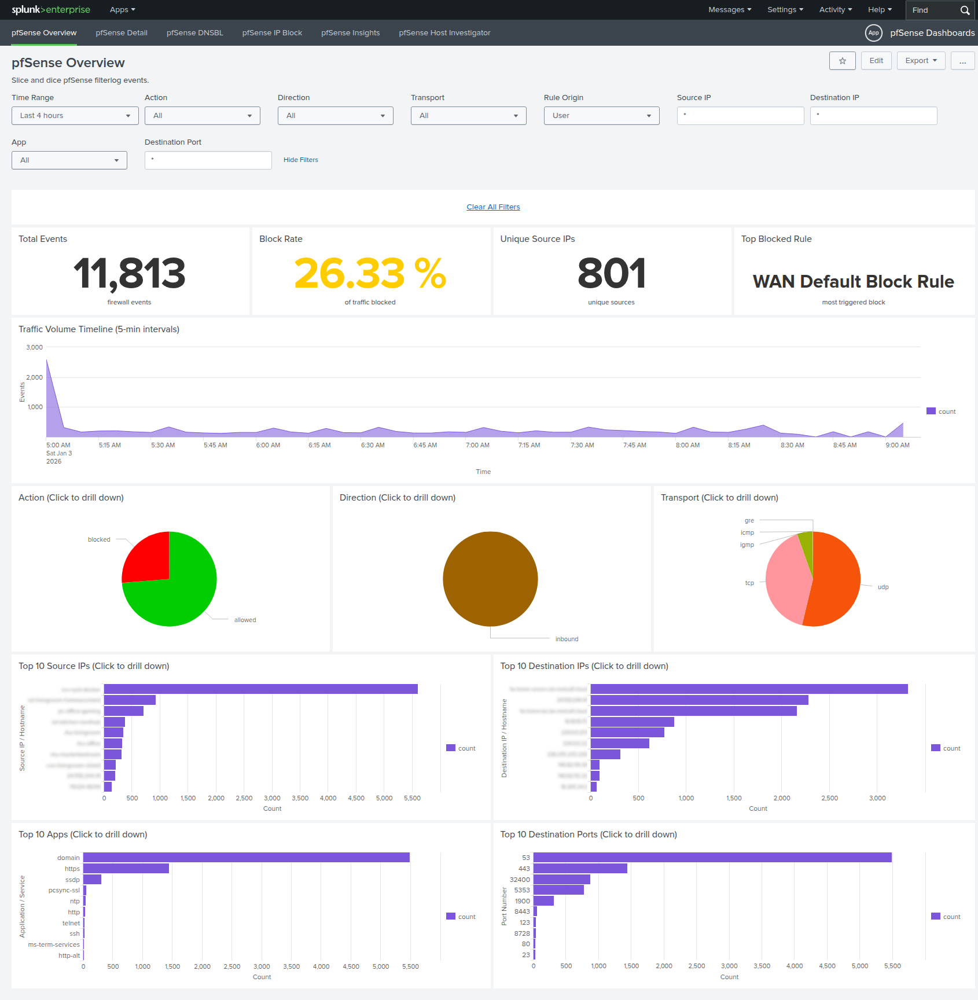
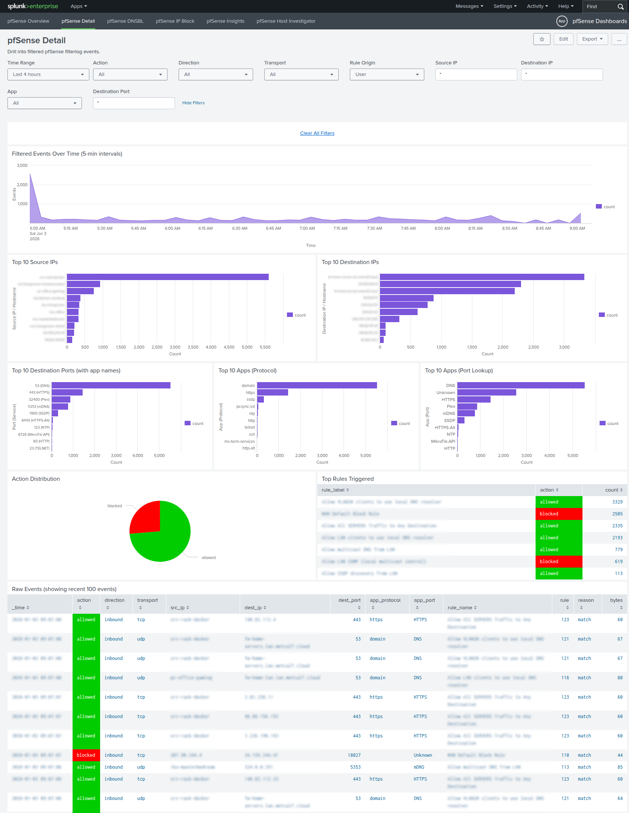
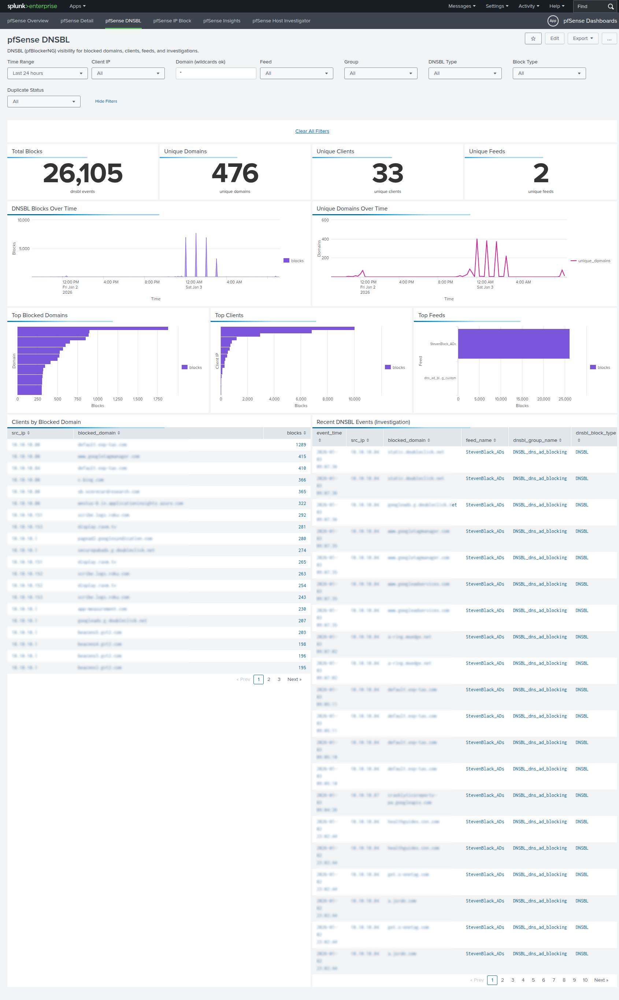
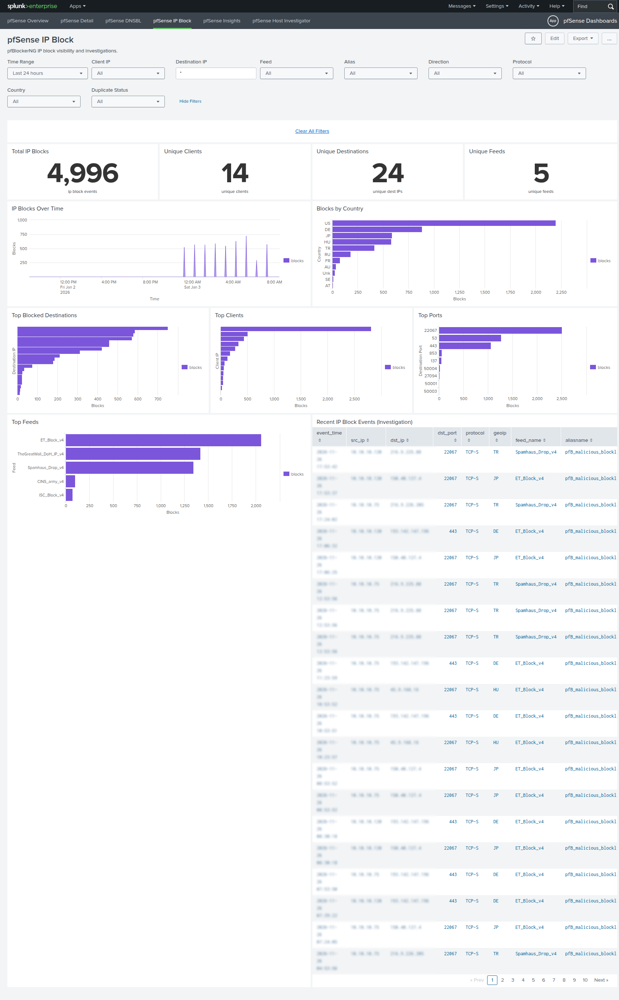
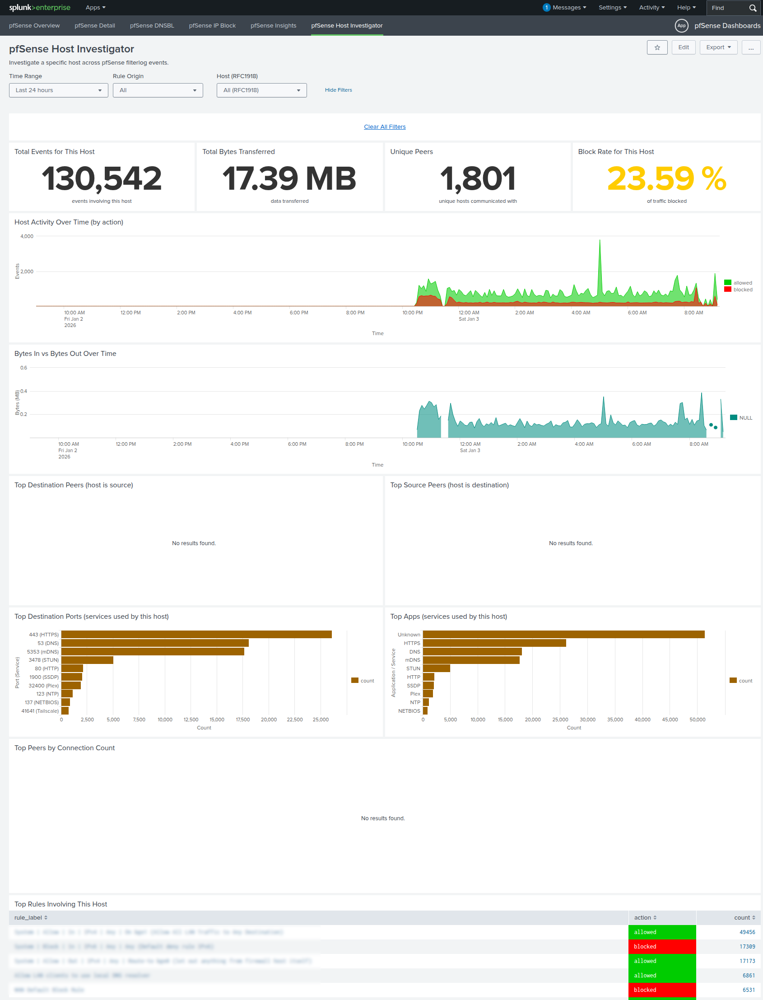

# pfSense Dashboards

Splunk dashboards for pfSense firewall, DNSBL, and pfBlockerNG IP block
activity, built for investigation and operational visibility.

## Requirements

* Splunk Enterprise 8.0+
* **TA-pfsense-plus** installed (required for field extractions)

## Install

1. Install from Splunkbase, or copy the app to `$SPLUNK_HOME/etc/apps/pfsense-dashboards`.
2. Restart or reload Splunk.

## Configuration

### Index Configuration

By default, dashboards search `index=pfsense`. To use a different index:

1. Create `$SPLUNK_HOME/etc/apps/pfsense-dashboards/local/macros.conf`
2. Add the following:

```
[pfsense_index]
definition = index=your_pfsense_index
```

3. Restart Splunk or refresh the app

### Data Requirements

* Firewall logs: `sourcetype=pfsense:filterlog`
* DNSBL data: `sourcetype=pfsense:dnsbl`
* IP block data: `sourcetype=pfsense:iplog`
* VPN logs: `sourcetype=pfsense:openvpn`
* DNS queries: `sourcetype=pfsense:unbound`
* IDS/IPS: `sourcetype=pfsense:suricata`

### Lookup Enrichment (Optional)

The dashboards can be enriched with optional pfSense lookups (rules, interfaces,
DNS hosts). See the TA-pfsense Plus README for the scripts and setup details:
https://github.com/ptmetcalf/ta-pfsense-plus/blob/main/README.md

Recommended (clean separation):
1. Create a small local app, e.g. `$SPLUNK_HOME/etc/apps/pfsense-local/`
2. Put CSVs in `$SPLUNK_HOME/etc/apps/pfsense-local/lookups/`
3. Add `local/lookup_table_files.conf` in that app with the same lookup names:
```
[pfsense_filter_rule_map]
filename = $SPLUNK_HOME/etc/apps/pfsense-local/lookups/pfsense_filter_rule_map.csv

[pfsense_interface_map]
filename = $SPLUNK_HOME/etc/apps/pfsense-local/lookups/pfsense_interface_map.csv

[pfsense_dns_hosts]
filename = $SPLUNK_HOME/etc/apps/pfsense-local/lookups/pfsense_dns_hosts.csv
```

Simple setups can also override directly in:
`$SPLUNK_HOME/etc/apps/pfsense-dashboards/local/lookup_table_files.conf`
using the same lookup names. Splunk will prefer local overrides over defaults.

Optional interface/zone/gateway/port enrichment lookups live in the TA app. See
`docs/panels.md` and use
`$SPLUNK_HOME/etc/apps/ta-pfsense-plus/tools/pfsense-lookups.py enrichment`
to generate instance-specific CSVs from a pfSense `config.xml` dump.

## Dashboards

### pfSense Overview
Main dashboard for filtering and analyzing firewall events. Includes filters for action, direction, transport protocol, and rule origin.

### pfSense Detail
Detailed view of individual firewall events with full field visibility.

### pfSense DNSBL
Dashboard for pfBlockerNG DNS blacklist activity, showing blocked domains, source IPs, and feed information.

### pfSense Suricata
Suricata IDS dashboard for alerts, signatures, and top talkers.

### pfSense IP Log
Dashboard for pfBlockerNG IP block events, tracking blocked IPs by feed and geolocation.

### pfSense Host
Host-centric view for investigating specific source or destination hosts.

## Contributing

See `CONTRIBUTING.md` for AppInspect and packaging steps.

## Screenshots

Main overview dashboard with filters and statistics.


Detailed event view with full field visibility.


DNSBL blocked domains analysis.


pfBlockerNG IP block events.


Statistical trends and insights.

Host-centric investigation view.


All sensitive data (IPs, hostnames, domains) has been sanitized for public distribution.

## Support

For issues or feature requests, please use the GitHub repository issue tracker.
